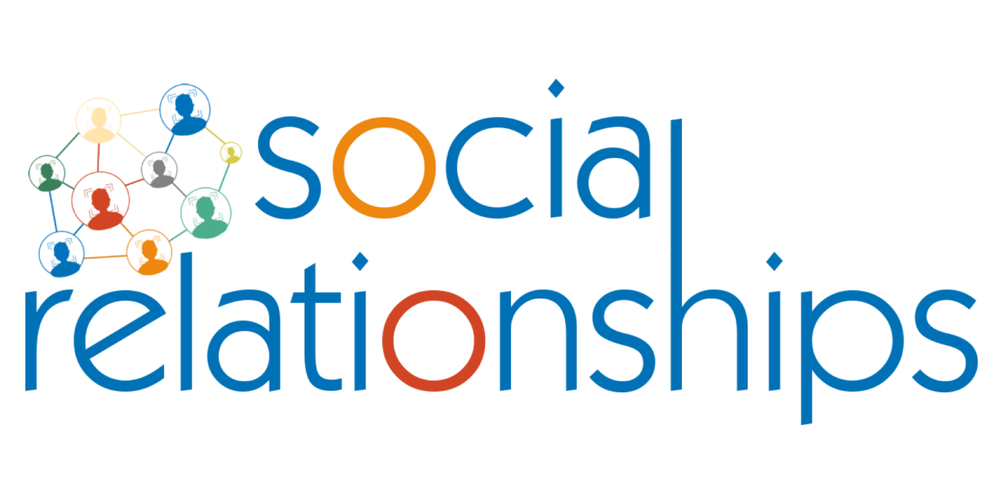
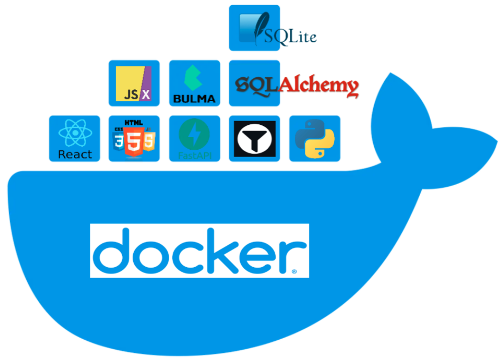

___________________________
[](https://github.com/psf/black)

___________________________

## Introduction
Our final project addresses a common challenge faced by teachers in large classes: the lack of personal attention and understanding of individual students. By providing a platform for teachers to monitor and analyze the social lives of their students, we aim to empower teachers to provide more targeted and effective support to those in need.

## Problem
In large classes, it can be difficult for teachers to get to know their students well and identify those who may be struggling socially or academically. This can make it challenging for teachers to provide the necessary support to help students succeed.

## Solution
To help teachers overcome this challenge, our analysis platform allows them to monitor and analyze student social relationships. By uploading and tagging photos of their students and class events, teachers can use the platform to determine which students are more or less socially involved. This information can help teachers to identify students who may need additional support and also know which students are particularly sociable and may be able to help create a more positive and inclusive class culture.

## Product
Our product consists of three main components:
1. **Students**: Teachers can add, update, and view student names and images in the system.
2. **Images**: Teachers can upload and update images, for example, images from class events.
3. **Reports**: Teachers can generate a variety of reports, including tabular and graphical reports, to help them make informed decisions about their students' social lives and needs.

## Conclusion
We believe that our targeting platform has the potential to significantly improve the personal attention and support that teachers can provide to their students. By empowering teachers to better understand their students and identify those who may need additional support, we hope to help create a more positive and inclusive learning environment for all.

## Team
* [David Katz](https://github.com/DavidKatz-il)
* [Nathan Paneth](https://github.com/NathanPaneth)
* [Yaakov Dayan](https://github.com/yaakovdayan)

      
___________________________


#### Technologies:



#### Build environment:
```bash
docker compose build
```

#### Run environment:
```bash
docker compose up
```

#### Format python code style:
##### Fron inside the `backend` folder run
```bash
make docker_build
make docker_dev_build
make lint
```
